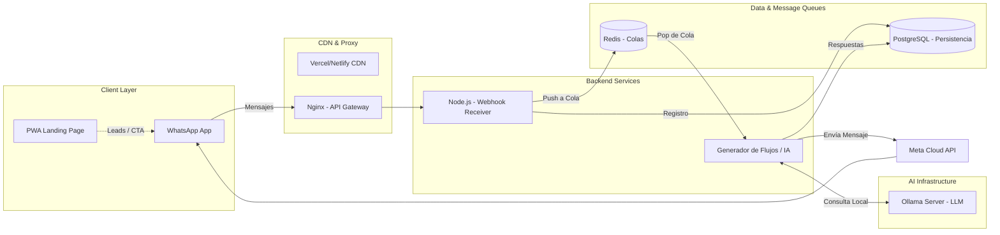

# Arquitectura del Sistema - IzignaMx Express Landing & WhatsApp Bot

## Índice

- [Visión General](#visión-general)
- [Dominios Clave](#dominios-clave)
- [Diagrama de Arquitectura](#diagrama-de-arquitectura)
- [Decisiones de Diseño (ADRs)](#decisiones-de-diseño-adrs)
- [Prácticas de Desarrollo (TDD & Clean Code)](#prácticas-de-desarrollo-tdd--clean-code)
- [Iteraciones y Hoja de Ruta](#iteraciones-y-hoja-de-ruta)

---

## Visión General

El sistema se compone de dos frentes principales:

1. **PWA Landing Page (Frontend)**: Sitio estático, optimizado para alto rendimiento, con un enfoque "neon-futurista". Construido con HTML semántico, CSS/JS inline para velocidad óptima, y soporte offline mediante Web Workers (PWA). Sirve como el principal embudo de captación de leads (B2B).
2. **WhatsApp AI Bot (Backend)**: Backend contenerizado en Node.js que orquesta mensajes entrantes de clientes, conectado a modelos de IA auto-hospedados (Ollama/Llama) para respuestas conversacionales, y gestionado mediante PostgreSQL y Redis para persistencia y colas.

El objetivo a medio plazo es consolidar la plataforma en una arquitectura SaaS multi-tenant que soporte la atención omnicanal, la automatización por reglas y el uso de Inteligencia Artificial como fallback (o agente principal).

---

## Dominios Clave

### 1. Aplicaciones Cliente (Frontend)

- **Express Landing (PWA)**: UI estática, 100% responsiva y optimizada para accesibilidad (WCAG AA).
- **Internacionalización (i18n)**: Basado en diccionarios JSON estáticos cargados asíncronamente según el `languageMap`.

### 2. Core Conversacional (Backend)

- **Orquestador**: Motor Node.js (`src/server.js` / Express) que maneja Webhooks.
- **Queue System**: Redis (`message_queue`) para desacoplar recepción de mensajes de su procesamiento pesado (IA).
- **Procesador IA**: Abstracción que consulta a un proveedor LLM (Ollama con modelo `llama2:7b` u otros) para generar respuestas contextuales.

### 3. Integraciones y Canales

- **WhatsApp Cloud API**: Vía Meta Developer Console, canal principal de comunicación B2B/B2C.
- **Bases de Datos**: PostgreSQL 15, almacena usuarios (`user_sessions`), historial de mensajes (`messages`), y auditorías.

---

## Diagrama de Arquitectura

---

## Decisiones de Diseño (ADRs)

1. **Despliegue de IA Auto-hospedada**: Se prioriza control de privacidad y previsibilidad de costos utilizando infraestructura local (Ollama) en contenedores, en lugar de APIs externas (salvo como fallback).
2. **PostgreSQL como Fuente de Verdad Multi-Tenant**: Uso de esquemas compartidos con RLS (Row Level Security) proyectado para aislar datos si la plataforma agrupa múltiples tiendas/clientes.
3. **PWA Estático Puro**: La landing prioriza el TTI (Time to Interactive) usando recursos inline, prescindiendo de frameworks SPAs pesados (React/Next) en el lado del cliente público para garantizar lighthouse de ~100.
4. **Acoplamiento Débil de Tareas**: Intermediación con Redis entre la recepción del Webhook (rápido) y la inferencia del modelo LLM (lento) para evitar _timeouts_ de WhatsApp.

---

## Prácticas de Desarrollo (TDD & Clean Code)

En esta plataforma se asumen las directrices conjuntas de un **Seniot Architect**, **Senior Fullstack** y la disciplina **Test-Driven Development (TDD)**:

### 1. No hay Producción Sin Pruebas (Red-Green-Refactor)

- **RED**: Toda característica nueva o corrección de error empieza escribiendo una prueba funcional mínima (Jest/Playwright). Validar que falla.
- **GREEN**: Escribir el código estrictamente necesario para que pase.
- **REFACTOR**: Optimizar, aplicar Patrones de Diseño (Inyección de Dependencias, Adapter para canales), limpiando la deuda.

### 2. Estándares Fullstack

- **Tipado Fuerte**: Gradual transición o aplicación de Typescript / JSDoc para interfaces robustas.
- **Calidad de Código**: Linter (ESLint) estricto, Prettier para formateo unificado.
- **Modularidad**: Componentización de los bots. Por ejemplo, `FlowEngine.js`, `WhatsAppAdapter.js`, `AIProvider.js`, buscando alta cohesión y bajo acoplamiento.

### 3. Desarrollo Orientado a Agentes (Agent-Driven)

Al escribir nuevos sub-sistemas, se usarán prompts y descripciones de contexto claros (`name`, `description`, `system prompt` como en `AGENTS.md`) para ayudar a herramientas automatizadas y a LLMs a contribuir con seguridad, validando contra las pruebas unitarias.

---

## Iteraciones y Hoja de Ruta

- **Fase 1 (MVP)**: Landing optimizada + Bot de WhatsApp básico en contenedores con respuestas LLM locales. Logging y PostgreSQL (Actual).
- **Fase 2**: Implementación multi-tenant en DB, colas avanzadas (RabbitMQ o BullMQ), integración en Landing (ChatWidget webchat conectado al back).
- **Fase 3**: Dashboard Administrativo Fullstack (Next.js) consumiendo APIs seguras para ver reportes de logs, consumo de Tokens y analítica.
